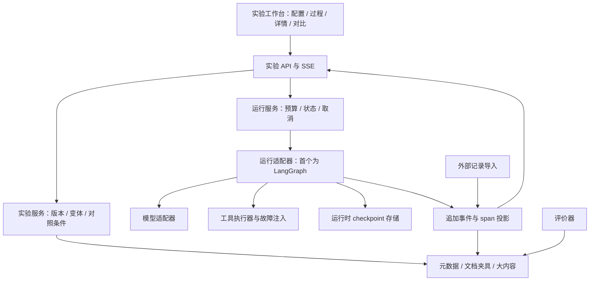

# AgentTinker 架构与开发路线

2026-10-08 · 提案 · 接口和数据模型均为待验证设计

## 1. 首先确定哪些能力可以承诺

“统一 Runtime”建议解释为统一运行服务和适配协议，先复用一个执行引擎。不要从零实现适配所有框架的执行、持久化和调度系统。

| 能力 | 所需数据/控制权 | 首版范围 |
| --- | --- | --- |
| 检查历史记录 | spans、输入输出、事件、来源 | 原生运行与受支持导入记录 |
| 回放记录 | 有序事件或可明确标注的历史摘要 | 只重建显示，不发生模型/工具请求 |
| 从头再次运行 | 任务、版本化配置、工具与模型可用 | 原生模板 |
| 从 checkpoint 重新执行 | 可恢复状态、对应运行时、相同兼容版本 | 原生串行流程的明确边界 |
| 修改后分支 | 上述条件，加状态/配置补丁校验 | 原生串行流程的允许字段 |
| 恢复任意外部 trace | 一份 trace 通常不足以提供可恢复状态 | 不承诺；由适配器逐项声明能力 |

[LangGraph 时间旅行文档](https://docs.langchain.com/oss/python/langgraph/use-time-travel)明确区分 checkpoint 恢复与状态分支，且后续节点重新调用外部服务。AgentTinker 的用户文案和适配器契约应保留这个区别。

## 2. 建议技术选择与取舍

| 领域 | 首版推荐 | 理由与更换边界 |
| --- | --- | --- |
| 前端 | React + TypeScript + Vite | 实验工作台无需先引入完整 SSR；静态案例浏览可独立构建 |
| 可视化 | React Flow + 等价步骤列表 | 借用图形交互；核心事件模型不绑定画布组件 |
| 服务端 | Python + FastAPI + Pydantic | Agent 生态和 schema 验证；JSON Schema/OpenAPI 生成前端类型 |
| 首个执行适配器 | LangGraph | 先验证 checkpoint、恢复和分支；版本在 M0 验证后锁定 |
| 模型访问 | 一个提供商的官方 SDK，通过薄适配器调用 | 首版锁定一种已验证的工具调用协议；密钥由服务端注入 |
| 存储 | 本地 SQLite + 文件 artifact store | 单用户开发和小规模实验；多 worker/多人协作时再迁 PostgreSQL |
| 事件传输 | HTTP 控制 + SSE 实时订阅 | 单向进度适配，操作通过明确的 API 发出 |
| tracing | 保留 OTel 标识与适配边界 | 首版自有实验事件；不把完整 OTel collector 作为前置部署条件 |
| 评测 | 规则检查 + 人工标签；评价器接口 | 从可验证事实起步；以后接模型评价和第三方评测 |

这是一组可维护性的建议，没有性能实测或必须采用某框架的约束。Sites、个人域名和独立托管在真实运行架构验证后再选；展示渠道不决定运行时的数据结构。

## 3. 组件关系



外部记录导入只写入标准化观测数据。它不能自动进入具有执行权限的适配器；必须另有兼容 runtime、状态和能力声明。

## 4. 关键对象

| 对象 | 关键内容 |
| --- | --- |
| ExperimentDefinition | 任务、成功条件、允许变量、场景说明和 schema 版本 |
| AgentDefinition | 模板、prompt 版本、工具 schema、策略参数和实现版本 |
| DatasetCase | case ID、输入、预期证据/结果、fixture 内容哈希 |
| Variant | 基线与候选的配置版本和差异，明确改变的因素 |
| Run | ID、实验/case/variant、模式、状态、运行配置、环境和父运行关系 |
| Span | 一次具体操作的 ID、父 span、逻辑节点、调用次数、输入输出、状态、用量 |
| Event | 不可变事实，如模型调用开始、工具失败、重试、checkpoint 保存、运行结束 |
| CheckpointRef | 适配器内部定位、兼容版本、恢复边界、状态引用和可修改字段 |
| Intervention | 分支点、配置/状态补丁、原始与修改后摘要、创建来源 |
| FaultPlan | 故障种类、目标逻辑调用、attempt 匹配、夹具版本和固定 seed（如使用） |
| EvaluationResult | 判分器版本、输入证据、分数/标签、解释、评价失败状态 |
| Artifact | 大文本、附件和文档内容，引用地址、内容哈希、来源与导出范围 |

Run 至少保存 provider、实际返回的模型标识、请求参数、prompt 版本、Agent 实现版本、工具版本、fixture hash、fault plan、评价器版本。无法得到的字段记为未知，不推断填充。

### 事件示例

以下 ID、时间和内容均为合成 schema 示例，不是实际运行记录。

```json
{
  "schema_version": "0.1",
  "event_id": "evt_example_0007",
  "run_id": "run_example_B",
  "seq": 7,
  "occurred_at": "2026-10-08T08:00:00.000Z",
  "received_at": "2026-10-08T08:00:00.004Z",
  "type": "tool.attempt_failed",
  "span_id": "span_search_attempt_1",
  "parent_span_id": "span_tool_search_1",
  "logical_node_id": "search_documents",
  "logical_call_id": "search_1",
  "attempt": 1,
  "data": {
    "error_code": "TOOL_TIMEOUT",
    "fault_plan_id": "fault_first_search_timeout",
    "origin": "injected",
    "retry_owner": "executor",
    "will_retry": true
  }
}
```

### 不能破坏的数据不变量

1. 每次模型调用、工具尝试有独立 span；循环的逻辑节点 ID 可以相同，具体调用 ID 不相同。
2. 服务端为每个 Run 分配单调递增 `seq`。SSE 用该序号续传，并按 event ID 去重。时间戳用于显示，不能单独建立因果顺序。
3. 先持久化事件，再广播。前端断线不应丢失最终状态；重连后先补齐缺口。
4. 投影表可以重建，原事件不覆盖。纠错或重新评价追加记录和版本，不篡改旧结果。
5. 运行时 checkpoint 才是恢复执行的依据；UI 重建的视图状态不能替代 checkpoint。
6. B 引用 A 的分支来源；保留复用的前缀与 B 的新增调用边界。显示完整路径时不能将复用前缀当作新产生的调用和费用。
7. 并行关系未来使用父子 span 和 links 表达；不能把 timestamp 排序后的列表当作真正串行依赖。
8. imported、live、recorded、synthetic 是来源/模式标签。导入记录缺失内部事件时，显示可得的 span 摘要，不生成假的模型流式输出。

## 5. 首个运行适配器

原生 ReAct 模板将模型决策和工具执行拆为明确节点。选定工具后的状态包括可验证的 tool call ID、工具名和参数，工具执行前保存 checkpoint。对首版串行流程，每次只处理一个可恢复工具调用边界。

允许的工具配置补丁限于 `tool_retry_limit` 和检索 `top_k`。模型生成的查询与 tool call ID 保留；工具 span 另外记录有效配置和 Intervention 引用。这样参数实验不需要伪改历史模型响应。

`capabilities` 建议包含：

```json
{
  "trace_view": true,
  "record_playback": true,
  "run_from_start": true,
  "fork_from_checkpoint": true,
  "patch_tool_policy": true,
  "patch_arbitrary_state": false,
  "pause_live_execution": false,
  "parallel_fork": false
}
```

这只是原生模板的目标能力；普通 trace 导入通常只有前两项，而且回放精度依赖实际记录内容。服务端逐次检查能力、checkpoint 存在性和兼容版本，不能只依赖前端禁用按钮。

分支流程：验证源运行 → 选择可恢复边界 → 验证允许的 patch → 创建新 Run/Intervention → 由适配器派生新 checkpoint 分支 → 恢复后续执行 → 记录新事件。不得覆盖 A；具体 LangGraph thread/checkpoint namespace 的映射在 M0 中验证。

代码或工具 schema 版本不兼容时，返回明确原因，并允许用户选择从头运行一个新版本；不静默用新代码恢复旧状态。

## 6. 故障、取消和中断

### 故障注入

放在工具边界，先验证输入，再根据固定规则决定超时、空结果或正常执行。每个逻辑调用使用独立 attempt 计数。分支 B 需要以相同 FaultPlan 初始化其新执行区间，避免继承全局“故障已经用掉”的计数而污染对照。

注入事件标记 `origin=injected`；自然发生的错误标记实际来源。执行器自动重试、模型观察错误后的另一次决策、从头重新运行三者分开记录。

### 运行状态

建议状态为 queued、running、cancel_requested、succeeded、failed、cancelled、interrupted；任务内容是否正确通过 EvaluationResult 表达，不与成功执行混在一起。

首版实时任务支持协作式取消：禁止启动下一次调用；支持中止的 SDK 调用尝试中止。已在途且不能中止的请求继续记录其实际结果和费用。界面显示 cancel_requested，直到运行真正终止。

进程意外退出后将未完成运行标为 interrupted。首版不自动重发外部调用；有有效 checkpoint 时让用户创建新的运行。单独定义工具超时、整体超时、最大步骤数及用量限制，避免无限调用。货币预算依赖价格与使用量可得性，不能宣称未知用量下的精确扣费上限。

首版工具局限于本地只读文档和纯计算，便于复跑。以后引入发邮件、写数据库等有副作用工具时，必须设计幂等性及重执行策略，不能默认“回到过去”会撤销现实中的操作。

## 7. 最小 API 草案

| 方法与路径 | 语义 |
| --- | --- |
| `GET /api/v1/scenarios` | 场景、任务说明、允许变量、可用模式 |
| `POST /api/v1/experiments` | 固定实验定义与版本引用 |
| `POST /api/v1/runs` | 创建并排队执行；接收 Idempotency-Key 避免重复点击启动多个任务 |
| `GET /api/v1/runs/{id}` | 当前状态、能力、配置、父运行与指标 |
| `GET /api/v1/runs/{id}/events` | SSE；按 Last-Event-ID 或 after_seq 补发事件 |
| `GET /api/v1/runs/{id}/spans` | 可分页步骤记录；支持逻辑节点和错误筛选 |
| `GET /api/v1/runs/{id}/checkpoints` | 可恢复边界与允许修改的字段 |
| `POST /api/v1/runs/{id}/cancel` | 幂等请求取消；不假定请求返回时远端已停止 |
| `POST /api/v1/runs/{id}/forks` | 带 checkpoint_ref 和 patch 创建新运行 |
| `POST /api/v1/comparisons` | 检查版本/案例可比性，生成 A/B 差异与限制说明 |
| `POST /api/v1/imports` | schema 验证后导入记录，保留来源与不可用能力 |
| `GET /api/v1/experiments/{id}/export` | 导出实验 manifest、脱敏记录和可分发 artifacts |

错误至少区分 checkpoint_missing、runtime_incompatible、unsupported_capability、invalid_patch、provider_not_configured、budget_exhausted。格式由 Pydantic schema 生成，不维护两套手写类型。

## 8. 评测和对比的口径

- **案例对齐：**同一 case ID、任务内容和 fixture hash；实验变体明确改变的字段。评价器定义改变后需同时重新评价两组。
- **结果与过程：**结果事实、证据可用性、引用有效性、工具参数有效性、重试/循环次数分别报告。
- **调用计数：**逻辑工具调用数和执行尝试数分开；缓存命中和复用历史前缀不增加本次实际调用数。
- **耗时：**端到端使用墙钟时间；并行步骤耗时不能简单相加得到总耗时。运行、排队、评价器耗时分开。
- **Token 与成本：**原始提供商用量优先；记录价格表版本/时间。缺失为 null，并显示覆盖率；估算金额明确标记。评价器成本与被测 Agent 成本分开。
- **统计：**首版两条运行只作个例比较。后续批量实验报告计划数、完成数、任务失败、基础设施失败、取消与缺失，避免幸存者偏差。
- **重复采样：**相同设置也不能保证模型确定性。后续采用多个案例与多次重复，交错或随机化运行顺序，并展示分布、样本量和适当的不确定性；不凭一次胜负宣布架构优劣。
- **因果解释：**单变量改变增强可解释性，但模型随机性仍存在。分支重跑共用前缀，不能冒充从头运行两个架构的公平基准。

[Langfuse 对照实验文档](https://langfuse.com/docs/evaluation/experiments/compare-experiments)可作为版本、缺失案例和判分错误处理的参考；具体 UI 与存储仍按我们的实验模型实现。

## 9. 实验包与导入边界

实验包建议由 manifest、scenario、agent_definition、fixtures、runs/events.jsonl、artifacts 和 evaluator definitions 构成。manifest 保存 schema 版本、文件哈希、数据来源及许可说明。

首版仅接受数据，不从导入包自动安装依赖或执行代码；评价器只能引用内置已知 ID。验证路径、文件大小、引用完整性和内容类型。凭据不写入记录或导出包，模型连接使用服务端引用。

导出包默认包含可分发夹具和脱敏记录，不包含私有 checkpoint。即使 checkpoint 本地存在，发给另一台机器也未必可恢复；分支能力必须重新检测。公开分享未来复用同一边界，另定义账户和访问控制。

## 10. 开发顺序与完成条件

以下按依赖排序，不是工期承诺。每个阶段产出可检查证据；技术验证失败时调整方案，再进入下一阶段。

| 阶段 | 具体工作 | 完成证据 |
| --- | --- | --- |
| M0：技术验证 | 一个模型节点、一个工具、两个 checkpoint；真实调用后从旧点分支；校验历史和新增费用 | A/B 原始记录、调用计数、旧记录不变、分支继承说明；锁定可用版本 |
| M1：运行记录 | 定义 schema、Run 状态机、SQLite、事件追加和 SSE | 运行失败/重试/取消可记录；刷新后历史可读；断线能补发且不重复 |
| M2：检查与回放 | 列表/图视图、节点详情、时间线、记录播放 | 实际事件驱动视图；回放不调用 provider/tool；未知值准确呈现 |
| M3：首个闭环 | 超时实验、单变量 fork、A/B 对比和内嵌讲解 | P01–P05、P09 验收通过；保存真实参考案例 |
| M4：可用首版 | 文档缺失实验、规则/人工评价、导入导出、无密钥回看 | P06–P10 验收通过；两份可独立理解的实验包 |
| M5：使用验证 | 同案例与 Studio/Phoenix 实操对照，小规模用户使用 | 记录诊断成功率、耗时和误解；决定扩展、调整或采用插件形式 |

M0 的模型真实执行依赖提供商凭据与可访问端点。本轮环境未声明就绪的模型密钥；若开发时仍缺失，可先用明确标记的假提供商验证事件协议，但 M0 的真实调用验收保持未完成。

### 开发任务清单

1. **CORE-01**：事件与对象 schema、合法状态转换、版本字段、完整性校验。
2. **RUNTIME-01**：LangGraph 适配验证，工具前 checkpoint 和只读工具恢复。
3. **RUNTIME-02**：工具 attempts、FaultPlan 计数与分支后的同条件注入。
4. **STORE-01**：运行元数据、事件、投影和 artifact 内容寻址；断线游标。
5. **UI-01**：任务配置、步骤列表、原始输入输出和错误详情。
6. **UI-02**：执行图、记录时间线、只播放历史事件的控制条。
7. **EXP-01**：分支能力检测、参数补丁、谱系和差异显示。
8. **EVAL-01**：过程检查、人工复核标签、可比性检测与用量口径。
9. **CONTENT-01**：两个带标准和说明的实验，以及真实录制的参考轨迹。
10. **PORT-01**：文件导入导出、版本/哈希验证、凭据排除与来源标签。

### 必要验证

- 用真实 provider 记录至少一次工具调用和一次分支，确认适配器语义；不靠模拟器证明真实恢复已完成。
- 对故障规则、状态转换、分支历史不变、序号去重做针对性测试。
- 对 SSE 中断重连、取消、进程退出做集成验证，检查最终状态与事件一致。
- 用端到端流程验证“创建基线 → 检查 → 分支 → 对比 → 导出 → 导入回看”。
- 用一份没有 checkpoint 的外部记录验证能力降级；用缺失用量/评分数据验证 UI 不显示虚假零值或成功。
- 检查键盘访问、颜色以外的状态信息和减少动画模式。

以上测试均为未来实现时的要求，本轮未执行应用测试。

## 11. 需要保留的决策空间

最终品牌、提供商、公开部署与商业模式现在都不阻挡 schema 和实验设计。应先解决的技术问题是：我们能否在不污染历史记录和实验条件的前提下，从一个明确边界创建真实可比较的新运行。

若 M0 无法可靠实现，先收缩到“从头重跑 + 差异对比”，保留记录回放，并更新产品承诺。若 M5 证明现有工具同样容易完成这些任务，则优先建设可执行实验内容和适配层，把维护投入集中在已验证的价值上。
